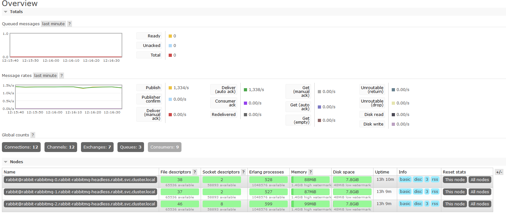

# mindbox

Установка проекта подразумевает наличие утилиты helm версии 3. 

```
git clone https://github.com/wbe7/mindbox.git
cd mindbox/
kubectl create ns rabbit
kubectl apply -f rabbit/rabbit-pas-secret.yaml
helm upgrade --install rabbit  stable/rabbitmq --wait --namespace=rabbit -f rabbit/values.yaml
```
ВНИМЕНИЕ! Для вашего кластера параметры будут другими. Необходимо в values.yaml поменять параметры для ingress. Должен быть установлен cert-manager и необходимые Issuers.

Так как мой кластер уже готов, воспользуемся им для тестов.

Запуск нагрузки (необходим установленный компилятор Golang последней версии):

```
go get github.com/streadway/amqp
cd cmd/send/
go run send.go
```
В двух других треминалах нужно запустить `go run send1.go` и `go run send2.go`.
Начнется генерация сообщений в очереди `hello`, `hello1` и `hello2`.
Consumers для данных очередей уже установленны в кластер.

Адрес управляющей консоли:

http://34.89.173.76:15672/#/



На данном кластере установлена политика репликции очередей на все узлы кластера, удовлетворяющих паттерну `^hello`, что дает нам отказоустойчивость.
Учитывая среднюю нагрузку в размере 1300 сообщений в секунду, мы получаем трафик около 100+ миллионов сообщений в день (и данный показатель не предел).

Также можно провести миграцию со старого брокера RabbitMQ на новый кластер в Kubernetes. Для этого необходимо на старом брокере настроить политику высокой доступности `ha-mode: all`. После необходимо объединить старый брокер с новыйм кластером, для этого надо зайти в каждый под нового кластера и выполнять join в старый брокер. Далее ожидаем синхранизацию сообщений, после чего переключаем весь приклад на новый адрес балансировщика кластера RabbitMQ в k8s и выполняем сброс объединения со старым брокером `rabbitmqctl reset`.

Таким образом мы можем мигрировать без недоступности.